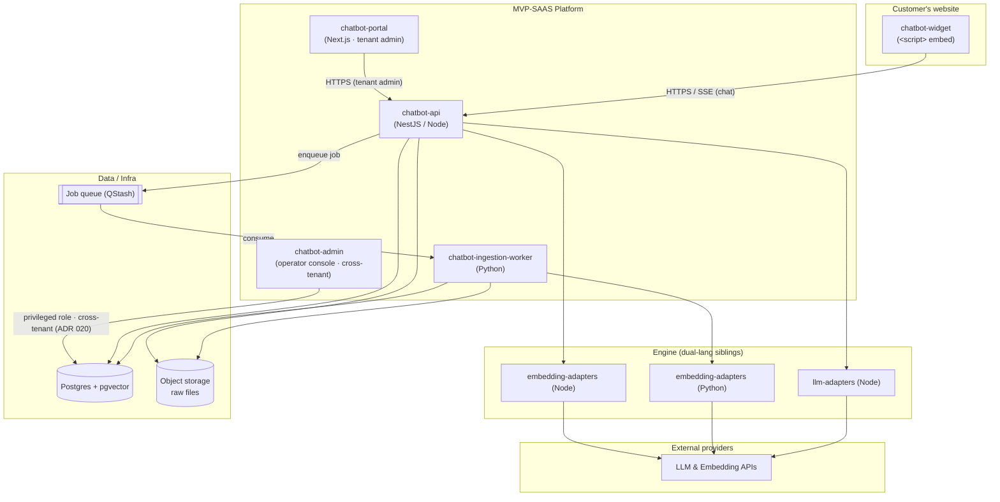
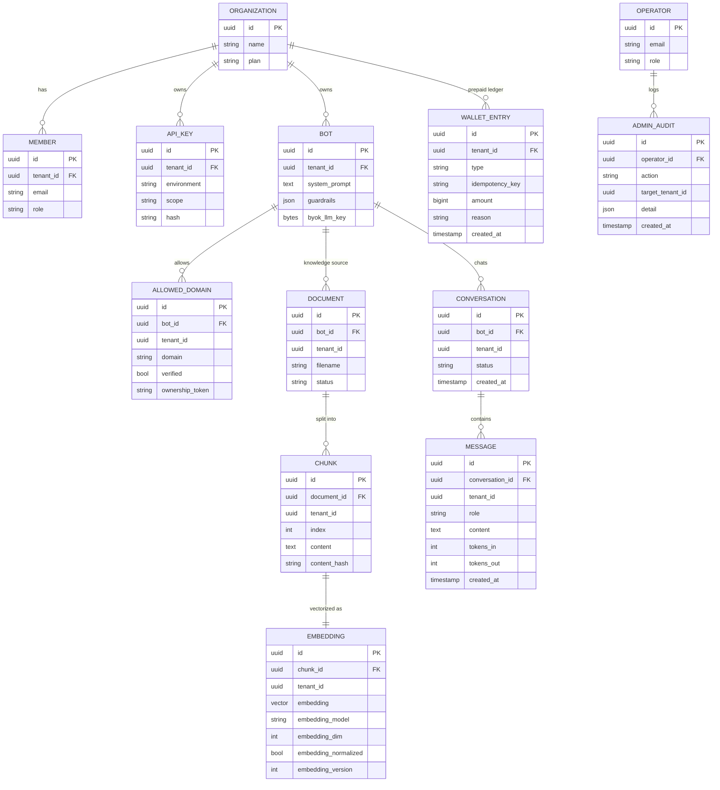
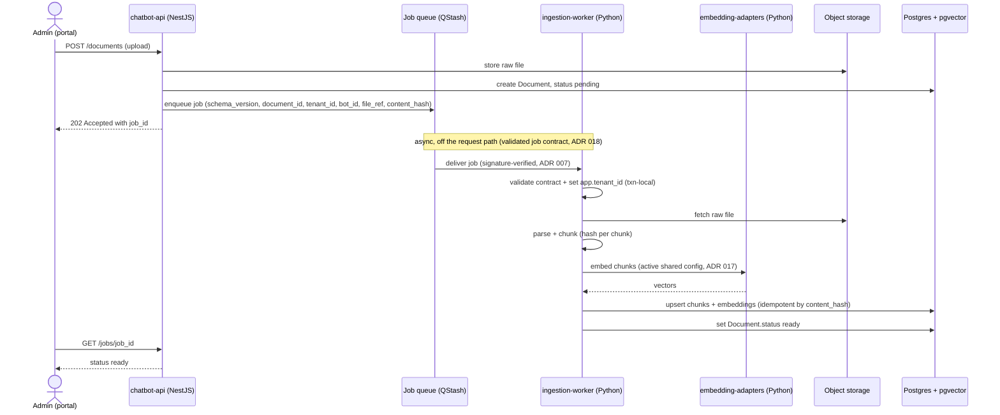
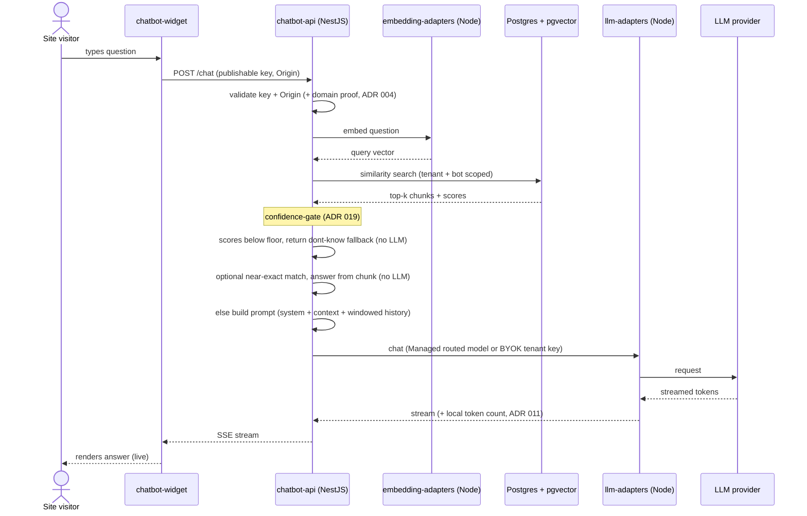
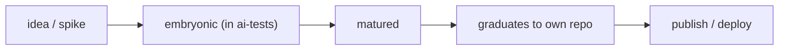

# ARCHITECTURE — MVP-SAAS

> Concept + diagrams. Companion to `FEATURES/README.md` (the feature graph),
> `CONTEXT.md` (working knowledge), `PROGRESS.md` (status).
> Last updated: 2026-06-20

---

## 1. Concept in one sentence

A **whitelabel RAG chatbot platform**: a customer uploads documents, configures a bot,
and drops a `<script>` on their site — the chat answers grounded in **their** documents.
LLM runs **Managed** by default at GA (platform key, wallet-billed); **BYOK** is the
M1–M2 bootstrap and later an Enterprise add-on (ADR 009/013).

## 2. Central principle — reuse, not reinvention

The AI engine is a pair of **co-built sibling libraries** in the monorepo (`llm-adapters`,
`embedding-adapters`) — **planned, not yet implemented** (both `0/48` / `0/47`, zero code; see
`FEATURES/README.md` → "Engine prerequisite"). This product is the **shell** (tenancy, ingestion,
retrieval quality, governance, distribution, monetization) wrapped around that engine, behind a clean
public interface so the extraction stays mechanical. "Reuse, not reinvention" = *don't re-implement RAG
primitives in the product*, **not** *the engine is already done*.

```
        ┌─────────────────────────────────────────────┐
        │            MVP-SAAS (the shell)             │
        │ tenancy · ingestion · RAG quality · widget  │
        │        · governance · monetization          │
        └───────────────┬─────────────────────────────┘
                        │ uses
        ┌───────────────▼─────────────────────────────┐
        │   Engine (co-built siblings — not yet built)│
        │     llm-adapters   ·   embedding-adapters   │
        └─────────────────────────────────────────────┘
```

## 3. Polyglot split — by ecosystem fit

Principle: **Python where the ecosystem matters** (document parsing, OCR, offline eval),
**Node where it's the common path** (API, chat, governance, query-embed). The TS stack
unifies API + portal + widget. (ADR 001)



- **chatbot-api (NestJS / Node)** — the brain. Auth, tenancy, retrieval, chat (SSE),
  usage/limits, ingestion *orchestration* (enqueues jobs). Node adapters for chat + query-embed.
- **chatbot-ingestion-worker (Python)** — the muscle. Parses (pypdf/pdfminer/unstructured/
  python-docx/pandas), chunks, embeds (Python `embedding-adapters`), upserts pgvector.
- **chatbot-portal (Next.js)** — the **tenant's** admin (orgs/bots/docs/keys/domains/dashboards),
  RLS-scoped to one org.
- **chatbot-admin (operator console)** — **our** surface, the third app. Cross-tenant by design via a
  **privileged role** (the deliberate inverse of RLS, ADR 020): tenant management, the **Research
  module** (graduated `research-app` — model/embedding catalog + unit costs), and cost×revenue
  analytics (`cost-attribution` / `revenue-analytics`). Physically separate, own operator auth,
  audited. **Largest blast radius in the system** — never a route inside `portal`.
- **chatbot-widget** — the distribution (publishable key + domain validation).

## 4. Domain model (multi-tenant)



> **`OPERATOR` / `ADMIN_AUDIT` are NOT tenant-scoped (ADR 020).** They live outside the `tenant_id`
> RLS boundary — operators are not tenant members, and the audit trail is the operator plane's
> append-only log (every privileged cross-tenant write). Only the `chatbot-admin` privileged role
> touches them; the API/worker/portal never do.

> **Isolation is physical (ADR 016).** One uniform key — `tenant_id` everywhere (FK on
> org-owned tables, denormalized on bot-scoped + hot-path tables) — so a single RLS policy
> `USING (tenant_id = current_setting('app.tenant_id')::uuid)` applies identically. Fail-closed:
> unset `tenant_id` → zero rows. The Python worker sets `app.tenant_id` transaction-locally too.
>
> **Conversation/Message persisted from M1 (ADR 008)** — history + metering substrate + future
> ticketing/quality-metrics hook, no retrofit.
>
> **Embedding identity on the vector row (ADR 017)** — `embedding_model/dim/normalized/version`
> guard the parity invariant and enable safe re-embed on model change (ADR 015).

## 5. Flow 1 — Ingestion (async, cross-language)



## 6. Flow 2 — Chat (RAG + streaming + the new gate)



> **confidence-gate (ADR 019)** is the new step between retrieval and generation: a **floor**
> that refuses to hallucinate when nothing is relevant, and an optional **ceiling** that answers
> without the LLM on near-exact matches (token savings + latency). Calibrated by `retrieval-eval`.
>
> **Managed hard cap (ADR 011, GA):** before each Managed generation the API derives an
> affordable `max_tokens` from the wallet balance at the anchor price; pairs with the
> wallet reserve/hold so no single answer drives the balance negative.

## 7. Decision index

Full rationale in `adr/` (source of truth). Features reference ADRs by number; see
`FEATURES/README.md` for the feature↔ADR mapping.

## 8. Lifecycle — incubation to product



While embryonic it lives in the `ai-tests` incubator, reusing the adapters as siblings. On
maturity it graduates to its own repo — so coupling stays at the public-interface level.
