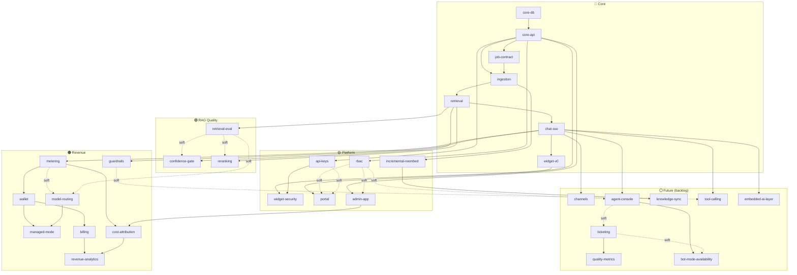

# FEATURES — Catalog & Dependency Graph

> The **primary structure** of the project. Each feature is an independent unit with
> explicit dependencies. Phases (F1–F4) are a *derived view* at the bottom.
> Last updated: 2026-06-20

---

## How to read this

- Each feature lives in `FEATURES/<slug>/PLAN.md` (objective, scope, deps, ADRs, done-criteria).
- **`depends_on`** is split:
  - **hard** = cannot start until the dependency is done (blocks).
  - **soft** = works without it, but is meaningfully better/calibrated with it.
- **Layer** groups features by concern, not by time. The recommended *order* is separate
  (see "Recommended queue").

## Layers

| Layer | Meaning |
|---|---|
| 🔵 Core | The inevitable co-dependent chain that proves the RAG loop |
| 🟢 RAG Quality | The showcase protagonist — retrieval quality |
| 🟡 Platform | Real multi-tenant product surface |
| 🟠 Revenue | Monetization (modeled, validated last) |
| ⚪ Future | Market-adjacency backlog (promotable; adjacent to the RAG core) |

---

## Catalog

### 🔵 Core (proves the loop)

| Feature | depends_on | ADRs | One-liner |
|---|---|---|---|
| `core-db` | — | 002, 016 | Postgres + pgvector + RLS scaffolding |
| `core-api` | core-db *(hard)* | 001 | NestJS skeleton + basic auth + single org |
| `job-contract` | core-api *(hard)* | 018, 007 | Versioned API↔worker job schema, validated both sides |
| `ingestion` | core-api *(hard)*, job-contract *(hard)* | 001, 007, 010, 017 | Python worker: parse → chunk → embed → pgvector |
| `retrieval` | ingestion *(hard)* | 002, 010, 016, 017 | Tenant-scoped similarity search over pgvector |
| `chat-sse` | retrieval *(hard)* | 008, 009, 005, 011 | RAG chat (SSE) via `llm-adapters`, BYOK bootstrap |
| `widget-v0` | chat-sse *(hard)* | 003 | Embeddable script + chat UI, single hardcoded domain |

### 🟢 RAG Quality (the showcase protagonist)

| Feature | depends_on | ADRs | One-liner |
|---|---|---|---|
| `retrieval-eval` | retrieval *(hard)* | — *(new)* | Eval harness: dataset + recall/precision metrics; calibrates everything below |
| `confidence-gate` | retrieval *(hard)*, retrieval-eval *(soft)* | **019** | Floor ("don't know" instead of hallucinate) + optional short-circuit without LLM |
| `reranking` | retrieval *(hard)*, retrieval-eval *(soft)* | — *(future `reranker-adapters`)* | Reorder top-k by relevance before the LLM |

### 🟡 Platform (real product surface)

| Feature | depends_on | ADRs | One-liner |
|---|---|---|---|
| `rbac` | core-api *(hard)* | 016 | Roles owner/admin/editor/viewer; room for future `agent` |
| `api-keys` | core-api *(hard)* | 003 | 2 axes (env × scope) + rotation/revocation |
| `widget-security` | widget-v0 *(hard)*, api-keys *(hard)* | 004 | Origin + domain-ownership proof + session token + abuse rate-limit |
| `incremental-reembed` | ingestion *(hard)* | 015 | Diff per chunk hash → re-embed only changed chunks |
| `portal` | core-api *(hard)*, rbac *(soft)*, api-keys *(soft)* | — | Next.js admin: orgs/bots/docs/keys/domains/dashboards |
| `admin-app` | core-api *(hard)*, rbac *(soft)* | **020** | Operator console (cross-tenant, privileged): tenant mgmt + Research module (graduated `research-app`) |

### 🟠 Revenue (modeled; validated last)

| Feature | depends_on | ADRs | One-liner |
|---|---|---|---|
| `metering` | chat-sse *(hard)* | 011 | Shadow mode: count usage + reconcile vs invoice, no charging |
| `model-routing` | metering *(soft)*, retrieval-eval *(soft)* | 014 | Route by complexity across a blended mix (the margin lever) |
| `wallet` | metering *(hard)* | 012 | Append-only ledger (credit/debit/hold/release), idempotent |
| `managed-mode` | wallet *(hard)*, model-routing *(hard)* | 009, 011, 013 | Managed default: wallet + routing + real-time hard cap |
| `billing` | wallet *(hard)* | 012 | Stripe + plans + `PaymentProvider` (PIX/boleto for BR) |
| `guardrails` | chat-sse *(hard)* | 006 | Prompt scoping + I/O filtering + injection resistance |
| `cost-attribution` | metering *(hard)*, admin-app *(hard)* | 011, 020 | Real cost per tenant: tokens × Research unit costs + infra allocation |
| `revenue-analytics` | billing *(hard)*, cost-attribution *(hard)* | 020 | Cost × revenue → margin per tenant + aggregate (MRR, top consumers) |

### ⚪ Future (backlog)

First-class features like the rest — each has a `FEATURES/<slug>/PLAN.md` — but **not committed
scope**. `Status: backlog`; any one can be **promoted** to a real layer freely.

| Feature | depends_on | ADRs | One-liner |
|---|---|---|---|
| `channels` | chat-sse *(hard)* | — *(new)* | Deliver the bot on official channels (WhatsApp first) |
| `agent-console` | chat-sse *(hard)*, rbac *(soft)* | — *(new)* | Human handoff + Agent Copilot (RAG-assisted live chat) |
| `ticketing` | agent-console *(soft, co-evolves)* | — *(new)* | Light conversation lifecycle (open→closed), no ITSM |
| `quality-metrics` | ticketing *(hard)* | — *(new)* | SLA / CSAT / NPS / response & resolution time |
| `bot-mode-availability` | agent-console *(hard)*, ticketing *(soft)* | — *(new)* | off/ai/human/hybrid + availability schedule + email fallback |
| `knowledge-sync` | incremental-reembed *(hard)* | 015 | Connect Drive/Notion/URL + auto re-embed on change |
| `tool-calling` | chat-sse *(hard)*, guardrails *(soft)* | 006 | RAG + actions: call tenant APIs for live/exact data |
| `embedded-ai-layer` | chat-sse *(hard)* | — *(new)* | Exploratory: plug our RAG brain inside Zenvia/Blip & peers |

---

## Dependency graph

> **24 active features** (🔵🟢🟡🟠) + **8 backlog** (⚪) = 32 total. Backlog cards depend on the
> active graph but commit nothing; promote one by moving it into a real layer.

---

## Recommended queue (showcase-first)

The dominant goal is **showcase first, revenue close behind**. So after the inevitable
core chain, RAG quality jumps ahead of revenue.

1. **Core chain** — `core-db → core-api → job-contract → ingestion → retrieval → chat-sse → widget-v0`
   *(inevitable; proves the loop)*
2. **`retrieval-eval`** — rises early: it's pure showcase *and* it calibrates everything in RAG quality + routing.
3. **`confidence-gate`** (floor first) — cheap, anti-hallucination, impressive.
4. **`reranking`** — completes the RAG-quality trio.
5. **`guardrails` (minimal: injection + I/O filtering)** — lands **before** the widget goes public,
   because an embeddable LLM surface is a live injection/abuse target the moment it's exposed.
6. **`widget-security` + `rbac` + `api-keys` + `portal` + `admin-app` (shell)** — the "real product" surface.
   The admin shell (tenant management + Research module) can land here; its cost×revenue analytics wait for revenue.
7. **`incremental-reembed`** — bounds re-embed cost; unblocks knowledge-sync later.
8. **`metering` (shadow)** — start measuring without charging.
9. **`model-routing` → `wallet` → `managed-mode` → `billing`** — revenue, validated last, on a measured base.
10. **`cost-attribution` → `revenue-analytics`** — per-tenant cost × revenue → margin; turns the modeled spread into a measured number (needs `metering` + `billing`).
11. **`guardrails` (full)** — system-prompt scoping config + hardening, before broad external rollout.

> **Why this order:** showcase value (RAG quality) is front-loaded; the unvalidated
> economic thesis (routing spread) is de-risked by `metering` shadow mode + `retrieval-eval`
> *before* money depends on it. **Guardrails are split:** a minimal injection/output filter ships
> *before* the public widget (step 5); the full per-bot scoping/hardening lands later (step 11).

---

## Derived view: the old F1–F4 phases

Kept so the previous roadmap work isn't lost. This is a *projection* of the feature graph
onto the old phase labels — not the primary structure.

| Phase | Theme | Features |
|---|---|---|
| **F1 — MVP** | Prove the loop | core-db, core-api, job-contract, ingestion, retrieval, chat-sse, widget-v0 |
| **F1.5 — Quality** *(new emphasis)* | RAG showcase | retrieval-eval, confidence-gate, reranking |
| **F2 — Multi-tenant** | Platform | rbac, api-keys, widget-security, incremental-reembed, portal, metering (shadow) · *guardrails (minimal: injection + I/O) lands here, before the public widget* |
| **F3 — Governance** | Production-ready | guardrails (full: per-bot scoping + hardening), rate limiting, plan limits, +docx/csv/xlsx |
| **F4 — GA** | Scale + revenue | model-routing, wallet, managed-mode, billing, OCR, URL crawl, moderation |

> **What moved vs. the old plan:** RAG quality (`retrieval-eval`, `confidence-gate`,
> `reranking`) was pulled forward from F4-nice-to-have into a first-class **F1.5** because
> the dominant goal is showcase. `confidence-gate` is **new** (ADR 019). Everything else maps
> back to a surviving ADR.
