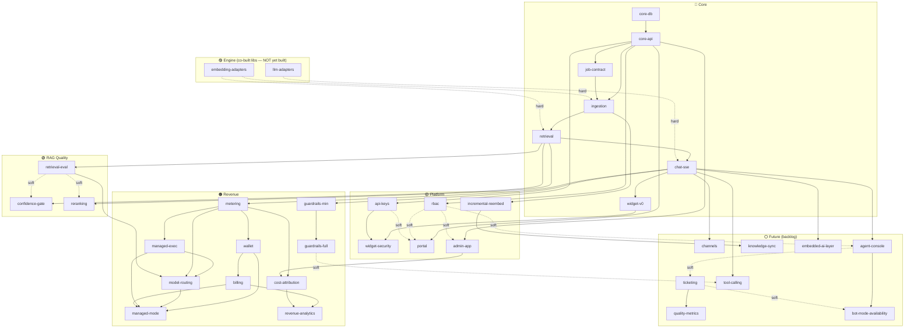

# FEATURES — Catalog & Dependency Graph

> The **primary structure** of the project. Each feature is an independent unit with
> explicit dependencies. The build order (incremental milestones M1–M4) is a *derived view* at the bottom.
> Last updated: 2026-06-20

---

## How to read this

- Each feature lives in `FEATURES/<slug>/PLAN.md` (objective, scope, deps, ADRs, done-criteria).
- **`depends_on`** is split:
  - **hard** = cannot start until the dependency is done (blocks).
  - **soft** = works without it, but is meaningfully better/calibrated with it.
- **Layer** groups features by concern, not by time. The recommended *order* is separate
  (see "Recommended queue").

## ⚠️ Engine prerequisite (not a feature — a co-built dependency)

This product is a **shell** around two adapter libraries, **`llm-adapters`** and
**`embedding-adapters`** (`ai-tests/@todo/`). **They are not yet built** — both are at
`0/48` and `0/47` planned items, zero code. So "reuse, not reinvention" means *reuse a sibling we are
**co-building**, not an existing asset*. Every 🔵 Core feature that calls a model
(`ingestion`, `retrieval`, `chat-sse`) **hard-depends** on the relevant adapter build existing first.
They appear as the graph's roots (`engine-libs`) below but are **counted separately** from
MVP-SAAS features.

> **Embedding-parity caveat (ADR 017):** whatever embedding model the research-app/admin-app selects
> must be implemented in **both** the Python (worker) and Node (API) builds of `embedding-adapters`,
> or retrieval degrades silently. Model selection is volatile (research-app is SSOT); the *both-builds*
> constraint is not.

## Layers

| Layer | Meaning |
|---|---|
| 🟣 Engine | Co-built adapter libs (`llm-adapters`, `embedding-adapters`) — prerequisite, not an MVP-SAAS feature |
| 🔵 Core | The inevitable co-dependent chain that proves the RAG loop |
| 🟢 RAG Quality | What makes the bot trustworthy — retrieval quality (anti-hallucination, relevance) |
| 🟡 Platform | Real multi-tenant product surface |
| 🟠 Revenue | Monetization (modeled, validated last) |
| ⚪ Future | Market-adjacency backlog (promotable; adjacent to the RAG core) |

---

## Catalog

### 🔵 Core (proves the loop)

| Feature | depends_on | ADRs | One-liner |
|---|---|---|---|
| `core-db` | — | 002, 016 | Postgres + pgvector + RLS scaffolding |
| `core-api` | core-db *(hard)* | 001 | NestJS skeleton + basic auth + single org |
| `job-contract` | core-api *(hard)* | 018, 007 | Versioned API↔worker job schema, validated both sides |
| `ingestion` | core-api *(hard)*, job-contract *(hard)*, `embedding-adapters` *(hard, co-built)* | 001, 007, 010, 017 | Python worker: parse → chunk → embed → pgvector |
| `retrieval` | ingestion *(hard)*, `embedding-adapters` *(hard, co-built)* | 002, 010, 016, 017 | Tenant-scoped similarity search over pgvector |
| `chat-sse` | retrieval *(hard)*, `llm-adapters` *(hard, co-built)* | 008, 009, 005, 011 | RAG chat (SSE) via `llm-adapters`, BYOK bootstrap |
| `widget-v0` | chat-sse *(hard)* | 003 | Embeddable script + chat UI, single hardcoded domain |

### 🟢 RAG Quality (what makes the bot trustworthy)

| Feature | depends_on | ADRs | One-liner |
|---|---|---|---|
| `retrieval-eval` | retrieval *(hard)* | — *(new)* | Eval harness: dataset + recall/precision metrics; calibrates everything below |
| `confidence-gate` | retrieval *(hard)*, retrieval-eval *(soft)* | **019** | Floor ("don't know" instead of hallucinate) + optional short-circuit without LLM |
| `reranking` | retrieval *(hard)*, retrieval-eval *(soft)* | — *(future `reranker-adapters`)* | Reorder top-k by relevance before the LLM |

### 🟡 Platform (real product surface)

| Feature | depends_on | ADRs | One-liner |
|---|---|---|---|
| `rbac` | core-api *(hard)* | 016 | Roles owner/admin/editor/viewer; room for future `agent` |
| `api-keys` | core-api *(hard)* | 003 | 2 axes (env × scope) + rotation/revocation |
| `widget-security` | widget-v0 *(hard)*, api-keys *(hard)* | 004 | Origin + domain-ownership proof + session token + abuse rate-limit |
| `incremental-reembed` | ingestion *(hard)* | 015 | Diff per chunk hash → re-embed only changed chunks |
| `portal` | core-api *(hard)*, rbac *(soft)*, api-keys *(soft)* | — | Next.js admin: orgs/bots/docs/keys/domains/dashboards |
| `admin-app` | core-api *(hard)*, rbac *(soft)* | **020** | Operator console (cross-tenant, privileged): tenant mgmt + Research module (graduated `research-app`) |

### 🟠 Revenue (modeled; validated last)

| Feature | depends_on | ADRs | One-liner |
|---|---|---|---|
| `metering` | chat-sse *(hard)* | 011 | Shadow mode: count usage + reconcile vs invoice (managed key only), no charging |
| `managed-exec` | chat-sse *(hard)*, metering *(hard)* | 009, 011, 014 | Un-billed Managed path (platform key + shadow meter) — breaks the routing↔managed cycle |
| `model-routing` | managed-exec *(hard)*, metering *(hard)*, retrieval-eval *(hard)* | 014 | Route by complexity across a blended mix (the margin lever) |
| `wallet` | metering *(hard)* | 012 | Append-only ledger (credit/debit/hold/release), idempotent |
| `billing` | wallet *(hard)* | 012 | Stripe + plans + `PaymentProvider` (PIX/boleto for BR) |
| `managed-mode` | managed-exec *(hard)*, wallet *(hard)*, model-routing *(hard)*, billing *(hard)* | 009, 011, 013 | Managed default for paying tenants: wallet debit + routing + real-time hard cap |
| `guardrails-min` | chat-sse *(hard)* | 006 | Minimal slice: prompt-injection resistance + I/O filtering, before the public widget |
| `guardrails-full` | guardrails-min *(hard)* | 006 | Per-bot system-prompt scoping + hardening, before broad rollout |
| `cost-attribution` | metering *(hard)*, admin-app *(hard)* | 011, 020 | Real cost per tenant: tokens × Research unit costs + infra allocation |
| `revenue-analytics` | billing *(hard)*, cost-attribution *(hard)* | 020 | Cost × revenue → margin per tenant + aggregate (MRR, top consumers) |

### ⚪ Future (backlog)

First-class features like the rest — each has a `FEATURES/<slug>/PLAN.md` — but **not committed
scope**. `Status: backlog`; any one can be **promoted** to a real layer freely.

| Feature | depends_on | ADRs | One-liner |
|---|---|---|---|
| `channels` | chat-sse *(hard)* | — *(new)* | Deliver the bot on official channels (WhatsApp first) |
| `agent-console` | chat-sse *(hard)*, rbac *(soft)* | — *(new)* | Human handoff + Agent Copilot (RAG-assisted live chat) |
| `ticketing` | agent-console *(soft, co-evolves)* | — *(new)* | Light conversation lifecycle (open→closed), no ITSM |
| `quality-metrics` | ticketing *(hard)* | — *(new)* | SLA / CSAT / NPS / response & resolution time |
| `bot-mode-availability` | agent-console *(hard)*, ticketing *(soft)* | — *(new)* | off/ai/human/hybrid + availability schedule + email fallback |
| `knowledge-sync` | incremental-reembed *(hard)* | 015 | Connect Drive/Notion/URL + auto re-embed on change |
| `tool-calling` | chat-sse *(hard)*, guardrails-full *(soft)* | 006 | RAG + actions: call tenant APIs for live/exact data |
| `embedded-ai-layer` | chat-sse *(hard)* | — *(new)* | Exploratory: plug our RAG brain inside Zenvia/Blip & peers |

---

## Dependency graph

> **26 active features** (🔵🟢🟡🟠) + **8 backlog** (⚪) = 34 total, **plus 2 co-built engine libs**
> (🟣, counted separately). Backlog cards depend on the active graph but commit nothing; promote one by
> moving it into a real layer.

---

## Recommended queue (incremental — validate product, then monetize)

Order each step to **ship something testable** and to **never build a money feature before the thing
it bills for exists**. The dependency graph above is the source of truth; this is the order to walk it.

0. **Engine libs** — `llm-adapters` + `embedding-adapters` reach a usable build (the prerequisite the
   Core chain calls). Tracked in their own `MVP/` plans; not an MVP-SAAS feature, but **blocks** Core.
1. **Core chain** — `core-db → core-api → job-contract → ingestion → retrieval → chat-sse → widget-v0`
   *(inevitable; proves the loop)*
2. **`guardrails-min` (injection + I/O filtering)** — lands **before** the widget goes public,
   because an embeddable LLM surface is a live injection/abuse target the moment it's exposed.
3. **`confidence-gate` (floor, uncalibrated default)** — cheap anti-hallucination: the bot says "I
   don't know" instead of making things up. Wanted **before the first real customer**, not after.
   Ships with a **safe default threshold**; calibrated properly in step 5 once `retrieval-eval` exists.
4. **`rbac` + `api-keys` + `widget-security` + `portal` + `admin-app` (shell)** — the self-service
   product surface: a customer signs up, uploads a doc, gets a key, embeds the widget safely.
5. **`retrieval-eval` → `reranking`** — measure retrieval quality and improve relevance; **calibrates
   the confidence-gate thresholds** (set safely in step 3) and (later) the routing blend.
6. **`incremental-reembed`** — bounds re-embed cost; unblocks knowledge-sync later.
7. **`metering` (shadow)** — start measuring real usage without charging anyone.
8. **`managed-exec` → `model-routing`** — stand up the un-billed Managed path on our platform key, run
   the blend on it, and **measure the real spread** before any wallet/charging exists.
9. **`wallet` → `billing` → `managed-mode`** — monetization, on a measured base. `managed-mode` needs
   **both** `wallet` (ledger) and `billing` (auto-recharge), so it lands after both.
10. **`cost-attribution` → `revenue-analytics`** — per-tenant cost × revenue → margin; turns the
   modeled spread into a measured number (needs `metering` + `billing`).
11. **`guardrails-full`** — per-bot system-prompt scoping + hardening, before broad external rollout.

> **Why this order:** a working, embeddable bot comes first (step 1); the public surface is made
> safe (anti-injection min, anti-hallucination floor) *before* real users touch it (steps 2–3); the
> self-service product lands (step 4); quality and cost-bounding harden it (steps 5–6); only then does
> money get layered on a base that already works and is **measured** (`metering` shadow + the
> `managed-exec` dogfood spread) *before* the spread is trusted (steps 7–10). **Guardrails are two
> features:** `guardrails-min` before the public widget (step 2); `guardrails-full` later (step 11).

---

## Derived view: incremental milestones (M1–M4)

A *projection* of the feature graph onto build milestones — **not** the primary structure. Each
milestone ends in something you can put in front of a user.

| Milestone | What you can do at the end | Features |
|---|---|---|
| **M1 — Closed loop** *(I test it)* | A bot answers from one tenant's docs, embedded on a page | engine-libs *(prereq)*, core-db, core-api, job-contract, ingestion, retrieval, chat-sse, widget-v0 |
| **M2 — Self-service product** *(a customer tests it alone)* | Sign up → upload doc → get key → embed safely; bot won't inject-leak or hallucinate | guardrails-min, confidence-gate (floor, uncalibrated default), rbac, api-keys, widget-security, portal, admin-app (shell) |
| **M3 — Trustworthy & bounded** *(it retains)* | Measured retrieval quality, calibrated floor, better relevance, bounded re-embed cost | retrieval-eval, reranking, incremental-reembed |
| **M4 — Monetized** *(it charges)* | Real usage metered, spread measured on a dogfood Managed path, wallet/Stripe billing, cost×revenue per tenant | metering (shadow), managed-exec, model-routing, wallet, billing, managed-mode, cost-attribution, revenue-analytics, guardrails-full |

> **Why milestones, not the old F1–F4:** the previous phase labels were tied to a "showcase-first"
> framing that's gone. These milestones are ordered by **incremental product validation toward
> revenue**: each one is shippable and de-risks the next. The `confidence-gate` floor sits in **M2**
> as an **uncalibrated safe default** (so the first customer's bot doesn't hallucinate); it is
> **calibrated against `retrieval-eval` in M3**. "Charges a real customer" in M4 is the pair
> `managed-mode` + `billing`, never either alone.
