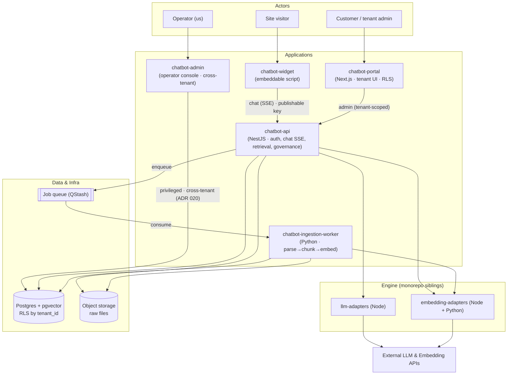

# MVP-SAAS — Whitelabel RAG Chatbot Platform

> Active workspace for the whitelabel RAG chatbot platform.
> Rebuilt from scratch on a **feature-graph model**, built in incremental revenue-oriented milestones.
> Last updated: 2026-06-20

---

## What this is

A **whitelabel RAG chatbot platform**: a tenant uploads documents, configures a bot
(prompt, guardrails, LLM mode, allowed domains), and embeds a chat widget on their own
site via a `<script>` snippet — answering grounded in **their** documents.

Built **on top of** the monorepo's adapter libraries (`llm-adapters`,
`embedding-adapters`) — a **product shell** around the engine, not a RAG reimplementation.

> ⚠️ **The engine is co-built, not pre-existing.** `llm-adapters` and `embedding-adapters` are
> **planned siblings, not yet implemented** (both at `0/48` / `0/47`, zero code). "Reuse, not
> reinvention" means *reuse a sibling we are co-building behind a clean interface* — it is **not** a
> finished asset. Every Core feature that calls a model hard-depends on the relevant adapter build
> existing first (see `FEATURES/README.md` → "Engine prerequisite").

## System map

- **Three surfaces:** `widget` (the site visitor), `portal` (the customer, **RLS-scoped** to one
  tenant), `admin` (the operator, **cross-tenant on a privileged role** — the deliberate inverse of
  RLS, ADR 020).
- **Polyglot seam:** the Node API **enqueues** ingestion jobs; the Python worker **consumes** them —
  heavy parsing/embedding stays off the request path (ADR 001/007).
- **Full detail** (dual-language adapters, ingestion & chat sequence flows) lives in `ARCHITECTURE.md`.

## How to navigate

| File | Purpose |
|---|---|
| `README.md` *(this)* | Entry point — what it is, how to navigate, status |
| `CONTEXT.md` | Compiled project knowledge (read first on a new session) |
| `PROGRESS.md` | Source of truth for "where are we" |
| `ARCHITECTURE.md` | Concept + diagrams (components, ER, flows) |
| `adr/` | Architecture Decision Records (the *why*) |
| `FEATURES/` | **The primary structure** — one folder per independent feature |
| `FEATURES/README.md` | Feature catalog: dependency graph + recommended queue |
| `PRICING/` | Economic model (margin thesis, plans) — distilled |
| `research-app/` | Live model-pricing tooling (Vite + lowdb OpenRouter/AA scanner) |

## The model in one line

This project is organized as a **graph of independent features** with explicit
dependencies (hard = blocks, soft = improves). The build order is a set of
**incremental validation milestones** (M1–M4), a *derived view* over the graph — not the
primary structure. See `FEATURES/README.md`.

## Strategic intent

**Build a sellable product, incrementally.** The goal is **revenue**: a multi-tenant RAG
product a customer embeds and pays for. The order ships a testable slice early and layers
monetization on top of a base that already works — never building money features before
the thing they bill for exists.

**Polyglot is an engineering decision, not a demo.** Python runs the ingestion worker
(parsing / OCR / offline eval — where the Python ecosystem wins); TypeScript runs
everything else (API, chat, portal, widget, admin). Use the strong language for each job.
(ADR 001)

## Incubation

Lives in `ai-tests` (incubator) while embryonic; **graduates to its own repo** before
publish/deploy. Keep dependencies on monorepo siblings (`llm-adapters`,
`embedding-adapters`) clean and explicit so the extraction stays mechanical.
