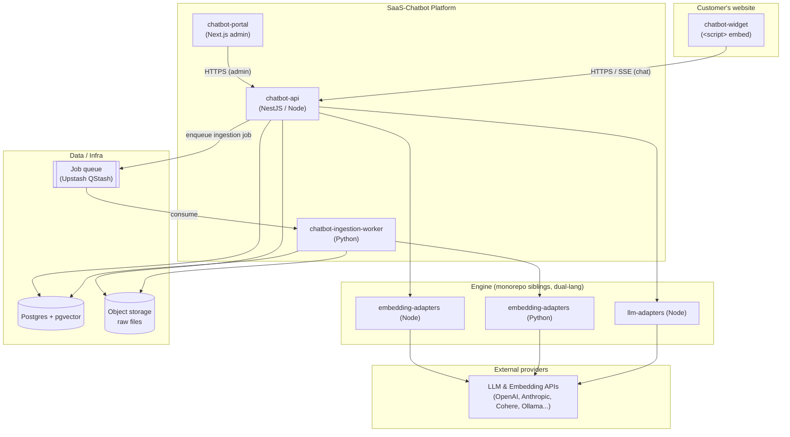
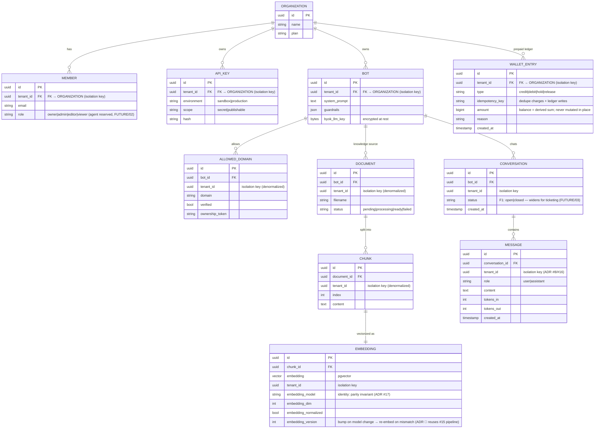
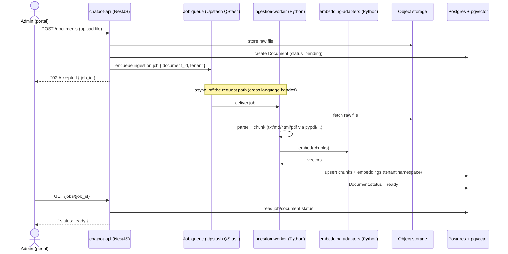
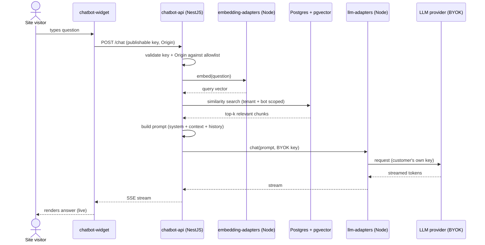
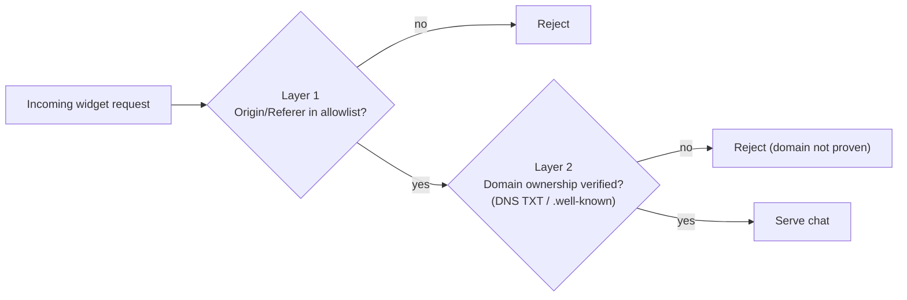
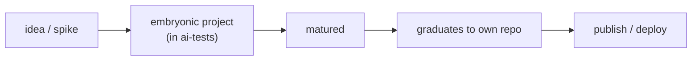

# SaaS-Chatbot — Architecture & Concept

> General architecture and conceptual overview of the whitelabel RAG chatbot platform.
> Companion to `PLAN.md` (roadmap), `CONTEXT.md` (working knowledge), `PROGRESS.md` (status).
> Last updated: 2026-06-14

---

## 1. Concept in one sentence

A **whitelabel RAG chatbot platform**: a customer uploads documents, configures a bot
(prompt, guardrails), and drops a `<script>` on their website — the chat answers using
**their documents** as grounding context. The LLM runs in **Managed** mode by default
(platform key, metered/wallet-billed), with **BYOK** available as an Enterprise add-on
(ADR #9/#13).

## 2. Problem it solves

To put a "chatbot that knows my documents" on a website today, you must: build an
embeddings pipeline, pick and operate a vector DB, manage LLM keys, build a chat UI
**and** an admin panel. This platform delivers all of that **ready-made and
multi-tenant** — the customer just uploads files and pastes a script tag.

## 3. Central architectural principle — *reuse, not reinvention*

The AI engine already exists in the monorepo (`llm-adapters`, `embedding-adapters`).
This product is the **product shell** (multi-tenancy, ingestion, governance,
distribution) wrapped around that engine.

```
        ┌─────────────────────────────────────────────┐
        │            SaaS-Chatbot (the shell)         │
        │  tenancy · ingestion · governance · widget  │
        └───────────────┬─────────────────────────────┘
                        │ uses
        ┌───────────────▼─────────────────────────────┐
        │      Engine (already in ai-tests)           │
        │     llm-adapters   ·   embedding-adapters   │
        └─────────────────────────────────────────────┘
```

---

## 4. Components (deployable units)

Four deployable pieces, all siblings under `ai-tests/pkgs/`. Note the **polyglot split**:
the API is NestJS (Node/TS) while the heavy document ingestion runs in a separate Python
worker — the adapters ship in both languages, so each side uses its native build.



- **chatbot-api (NestJS / Node)** — the brain. Auth, tenancy, RAG retrieval, chat (SSE),
  usage/limits, and ingestion *orchestration* (enqueues jobs). Uses the Node adapters for
  chat and query-time embedding.
- **chatbot-ingestion-worker (Python)** — the muscle. Consumes ingestion jobs: parses
  documents (pypdf/pdfminer/unstructured/python-docx/pandas), chunks, embeds via the Python
  `embedding-adapters`, and upserts into pgvector. Keeps heavy/slow work off the API.
- **chatbot-portal (Next.js)** — the admin. Manage orgs/bots, upload docs, configure
  prompt/guardrails, API keys, domains, dashboards.
- **chatbot-widget** — the distribution. Embeddable script that renders the chat on the
  customer's site, authenticated by a *publishable key* + domain validation.

---

## 5. Domain model (multi-tenant)




> **Tenant isolation is physical** — rows are scoped per tenant via **Postgres
> Row-Level Security (RLS)** by `tenant_id` (ADR #16; schema-per-tenant rejected), not
> just a shared `WHERE tenant_id = ?` filter. A single filter bug must not leak data
> across tenants.
>
> **One isolation key everywhere: `tenant_id`.** The tenant boundary is the `ORGANIZATION`,
> so on org-owned tables (`MEMBER`, `API_KEY`, `BOT`, `WALLET_ENTRY`) the `tenant_id` column
> **is** the FK to `ORGANIZATION`. Bot-scoped tables (`ALLOWED_DOMAIN`, `DOCUMENT`, `CHUNK`)
> additionally **denormalize `tenant_id`** so the RLS policy is identical on every table
> (`USING (tenant_id = current_setting('app.tenant_id')::uuid)`) — no per-table special case,
> no `bot_id → org_id` join on the hot path. Per ADR #16, **every** tenant-owned table carries
> `tenant_id` **and** an RLS policy from F1.


> **Worker writes are tenant-scoped too (ADR #16).** The Python ingestion worker writes
> `CHUNK`/`EMBEDDING`/`DOCUMENT.status` **off the request path**, so it cannot rely on the
> per-request session variable. It must set `app.tenant_id` **transaction-locally at the start
> of each job transaction** (from the `tenant_id` carried in the validated job contract, ADR
> #18) exactly as the API does per request — RLS is enforced on the worker's PG connection,
> not just the API's.


> **Conversation/Message persisted from F1** (ADR #8) — gives chat history, the substrate
> for per-message metering (`PRICING/billing.md` §5), and the hook for future ticketing /
> quality-metrics (`FUTURE/03`–`04`) without retrofitting the data model.


---

## 6. Flow 1 — Document ingestion (asynchronous, cross-language)

Embedding generation is CPU-heavy and slow, so it stays **off the request path** in a
dedicated Python worker. The NestJS API only orchestrates (enqueues + reports status).



---

## 7. Flow 2 — Chat (RAG + streaming)

Chat stays entirely inside the NestJS API, using the Node adapters end-to-end.



The retrieved context comes **only** from that tenant/bot's documents. The diagram shows the
**BYOK** path (the F1–F2 bootstrap), where the LLM call goes out with the **customer's own key**
and the platform never sees nor bills it. In **Managed** mode (the GA-target default, ADR #9/#13),
the call uses the **platform's** key and is metered + wallet-billed (see the hard-cap note below).

> **Managed mode — real-time hard cap on the stream (ADR #11):** before each generation
> the API derives an **affordable `max_tokens`** from the wallet's remaining balance at the
> anchor price and caps the provider call, so no single streamed answer can drive the
> balance negative. It pairs with the wallet **reserve/hold** (`WALLET_ENTRY`,
> `PRICING/billing.md` §4.1): reserve the estimated cost up front, reconcile to actual on
> completion. A stream that hits the cap stops cleanly with a "limit reached".

---

## 8. Architecture decisions (summary)

| # | Decision | Why |
|---|---|---|
| 1 | NestJS API + Python ingestion worker + Next.js front | Node API (TS unified w/ portal & widget) drives chat + query-embed; Python worker for heavy doc parsing; cross-language orchestration |
| 2 | Postgres + pgvector (single store) | Relational + vectors together; correct multi-tenant setup |
| 3 | API keys on 2 axes (environment × scope) | `publishable` (widget, domain-locked) vs `secret` (server-side) |
| 4 | Widget security = two layers (Origin + **domain ownership proof**) | `Origin` check alone is forgeable; DNS TXT / `.well-known` |
| 5 | BYOK encrypted at rest | Customer pays their own LLM; platform never sees/bills it |
| 6 | Guardrails — phased | Prompt scoping + I/O filtering first (F3); `moderation-adapters` later (F4) |
| 7 | `/ingest` asynchronous (job + polling) | Embeddings are CPU-bound |
| 8 | Conversation/Message persisted from F1 | History + per-message metering substrate + ticketing/quality-metrics hook |
| 9 | LLM in two modes — Managed (default) + BYOK | Managed = wallet; margin = routing spread (no markup); BYOK = Enterprise-only add-on |
| 10 | Embeddings always managed (never BYOK) | Cost is tiny; managed = better UX, baked into plan capacity (`PRICING/embeddings.md` §1.3) |
| 11 | Metering local in `llm-adapters` | Lib **computes** tokens; product **persists** usage → real-time hard cap |
| 12 | Stripe primary + `PaymentProvider` abstraction | Wallet auto-recharge + plug BR gateways (PIX) later without touching billing |
| 13 | Managed-first positioning | Managed default on every tier; **BYOK = Enterprise-only paid add-on** |
| 14 | Model routing / cascading (F4+) | Cheap model under the hood → routing spread is the margin |
| 15 | Incremental re-embed by chunk | Diff per chunk hash → keeps effective K ~1–2, bounds worst-case cost |
| 16 | Tenant isolation via Postgres RLS | Physical isolation by `tenant_id`; schema-per-tenant rejected |
| 17 | Embedding parity is a runtime invariant | Same model/dim/normalization on both sides or retrieval degrades silently |
| 18 | Ingestion job contract (the "sacred seam") | Versioned API↔worker job contract validated on both Node and Python sides |

Full rationale lives in `adr/` (source of truth); `PLAN.md` indexes them.


---

## 9. Widget security — the two layers (the catch)

Anyone can copy your `<script>` and publishable key, so trust needs **two barriers**:



1. **`Origin`/`Referer`** checked against the tenant allowlist (weak alone — easy to
   forge outside a browser).
2. **Domain ownership proof** — a DNS TXT record or a `/.well-known/<token>` file (like
   Google Search Console). Without it, the domain allowlist is decorative.

---

## 10. Lifecycle — incubation to product



While embryonic it lives in the `ai-tests` **incubator**, reusing the adapters as sibling
packages. On maturity it **graduates to its own repo** before publish/deploy — so coupling
to the adapters stays at the public-interface level, keeping the extraction mechanical.

---

## 11. Roadmap (phased: MVP → GA)

| Phase | Theme | Highlights |
|---|---|---|
| **F1 — MVP** | Prove the RAG loop | upload txt/md/html/pdf → chat (SSE, BYOK), 1 org, widget v0 |
| **F2 — Multi-tenant** | Platform | RBAC, API keys, usage counter, domain validation, portal |
| **F3 — Governance** | Production-ready | rate limiting, plan limits, guardrails, +docx/csv/xlsx |
| **F4 — GA** | Scale + extras | OCR (images/scanned PDF), URL crawl, reranking, billing-lite, moderation |

Detailed checklist per phase lives in `PROGRESS.md`.
